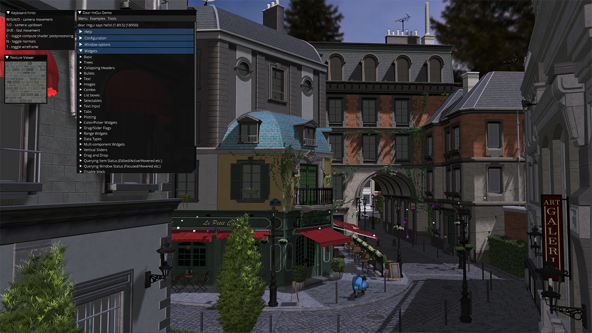

LightweightVK [](https://github.com/corporateshark/lightweightvk/actions)
========================

LightweightVK is a deeply refactored fork of [IGL](https://github.com/facebook/igl) which is designed to run on top of Vulkan 1.3.

The main goals of LightweightVK:

1. **Lean.** Minimalistic API without bloat (no `std::vector`, `std::unordered_map` etc in the API).
2. **Bindless.** Utilize Vulkan 1.3+ dynamic rendering, descriptor indexing, and buffer device address features for modern API design.
3. **Agile.** A playground for experiments to enable quick exploration of ideas and adoption of Vulkan API changes.
Designed for rapid prototyping of Vulkan-based renderers.

There are no plans to keep this fork in sync with the upstream.

## Supported rendering backends

 * Vulkan 1.3 (Windows, Linux)
 * Vulkan 1.2 + extensions (MacOS)

## Supported platforms

 * Linux
 * Windows
 * MacOS (via MoltenVK)

## API Support

|                          | Windows                    | Linux                      | MacOS
| ------------------------ | -------------------------- | -------------------------- | -------------------------- |
| Vulkan 1.3               | :heavy_check_mark:         | :heavy_check_mark:         | :heavy_exclamation_mark:   |
| Vulkan 1.2               |                            |                            | :heavy_check_mark:         |

:heavy_exclamation_mark: On MacOS dynamic rendering and subgroup size control required by LightweightVK are available via extensions `VK_KHR_dynamic_rendering` and `VK_EXT_subgroup_size_control`. `VK_KHR_maintenance4` and `VK_KHR_synchronization2` are not currently supported.

Check [here](https://github.com/KhronosGroup/MoltenVK/issues/1930) the status of Vulkan 1.3 support in MoltenVK.

## Build

Before building, run the deployment scripts:

```
python3 deploy_content.py
python3 deploy_deps.py

```

These scripts download external third-party dependencies. Please check [LICENSE.md](./LICENSE.md) for the full list.

### Windows

```
cd build
cmake .. -G "Visual Studio 17 2022"
```

### Linux

```
sudo apt-get install clang xorg-dev libxinerama-dev libxcursor-dev libgles2-mesa-dev libegl1-mesa-dev libglfw3-dev libglew-dev libstdc++-12-dev extra-cmake-modules libxkbcommon-x11-dev wayland-protocols
cd build
cmake .. -G "Unix Makefiles"
```

:heavy_exclamation_mark: Use `cmake .. -G "Unix Makefiles" -DLVK_WITH_WAYLAND=ON` to build for Wayland, X11 is used by default.

### MacOS

:heavy_exclamation_mark: Be sure that VulkanSDK 1.3.261.1+ for MacOS is installed https://vulkan.lunarg.com/sdk/home#mac

```
cd build
cmake .. -G "Xcode"
```

## Screenshots



## License

LightweightVK is released under the MIT license, see [LICENSE.md](./LICENSE.md) for the full text as well as third-party library
acknowledgements.
