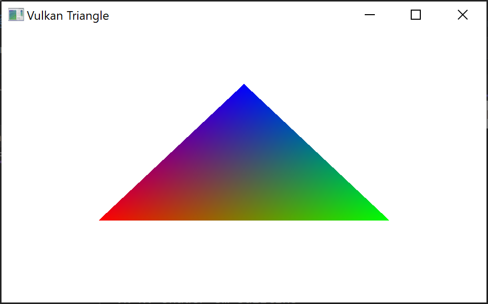
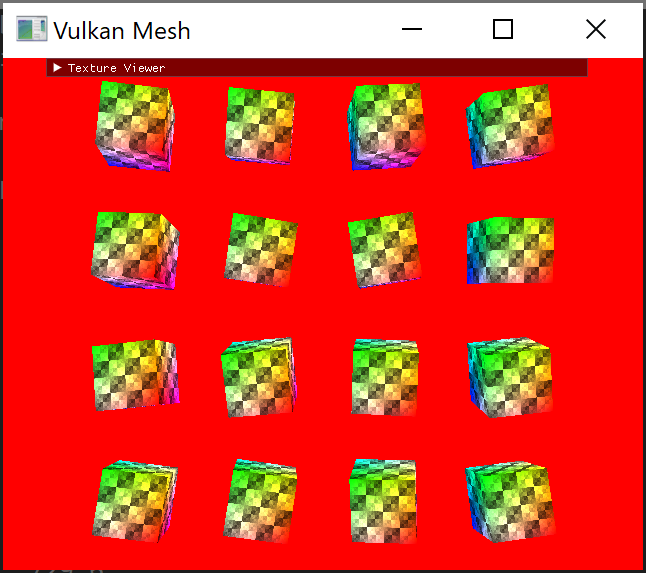
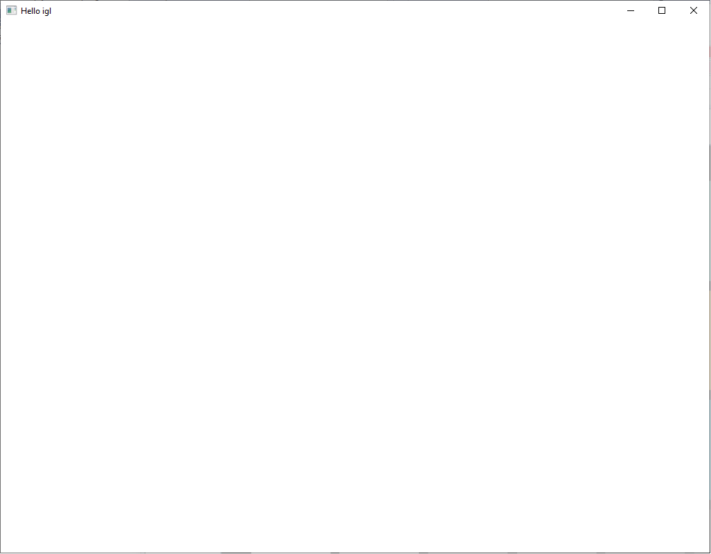
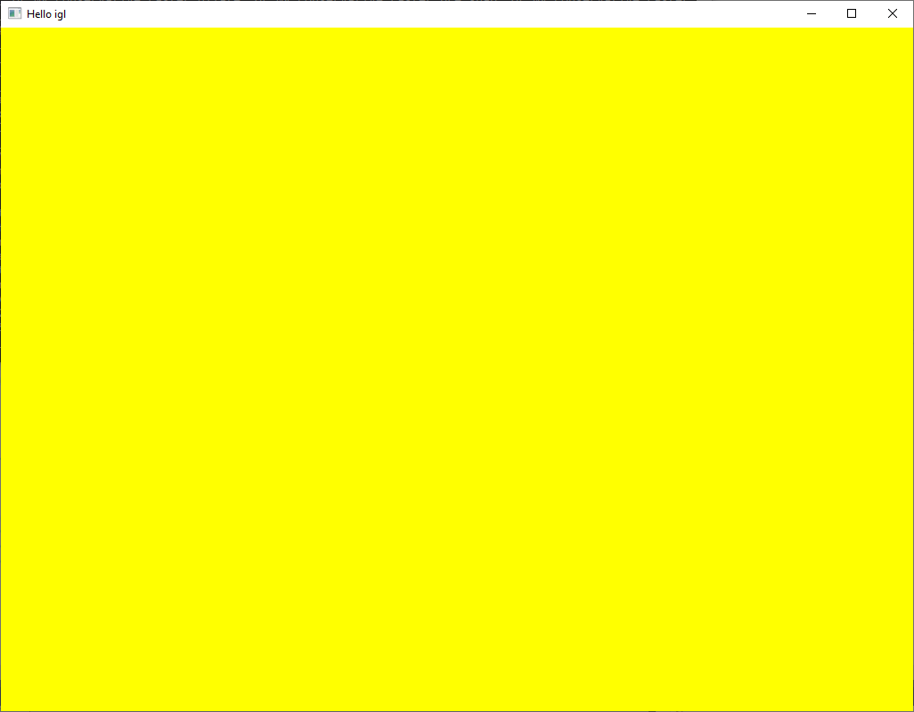
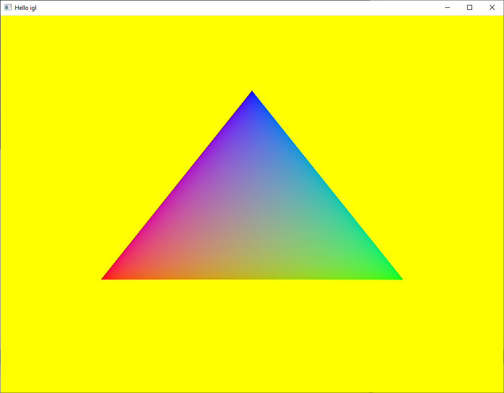
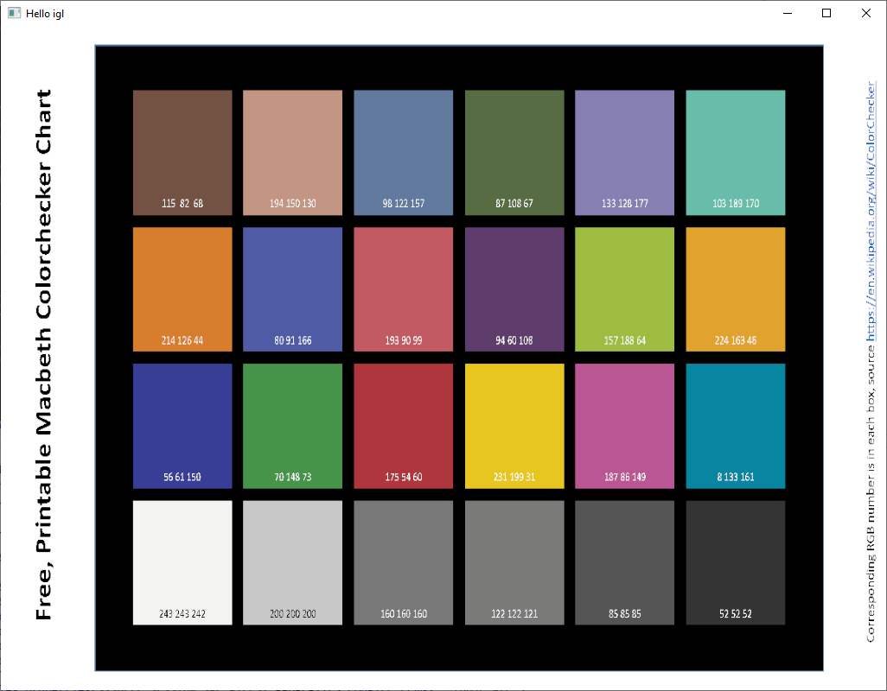
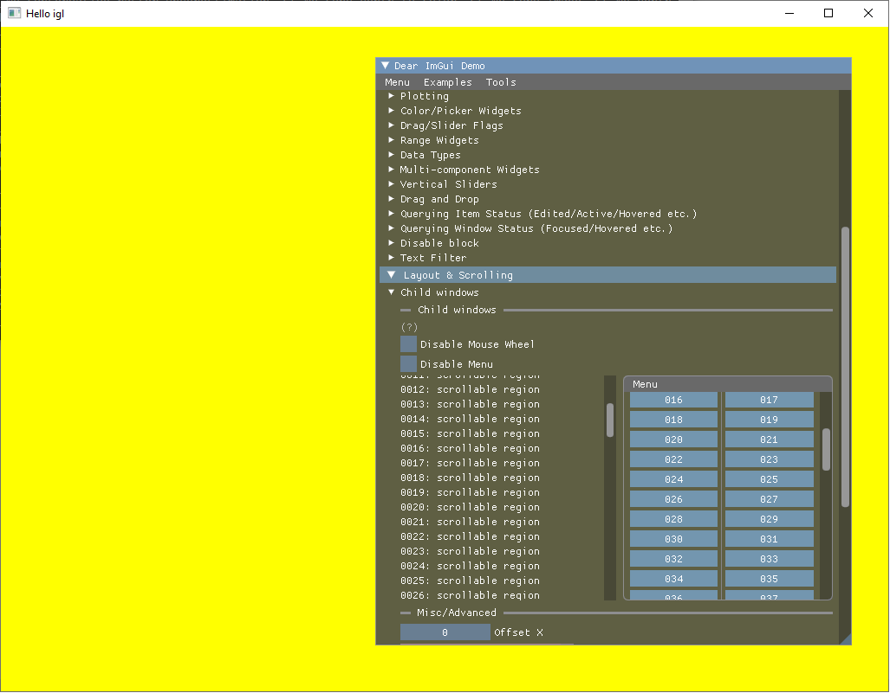
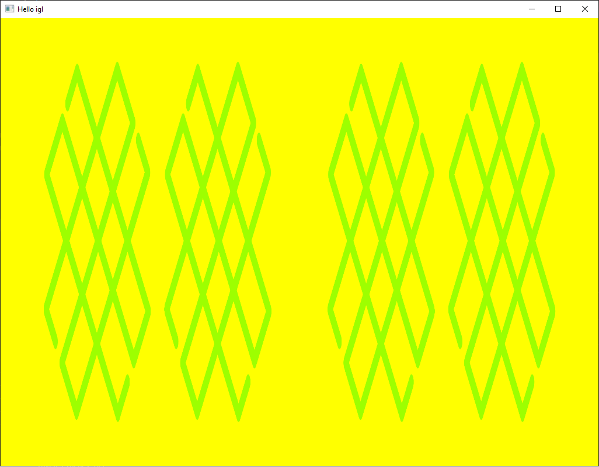
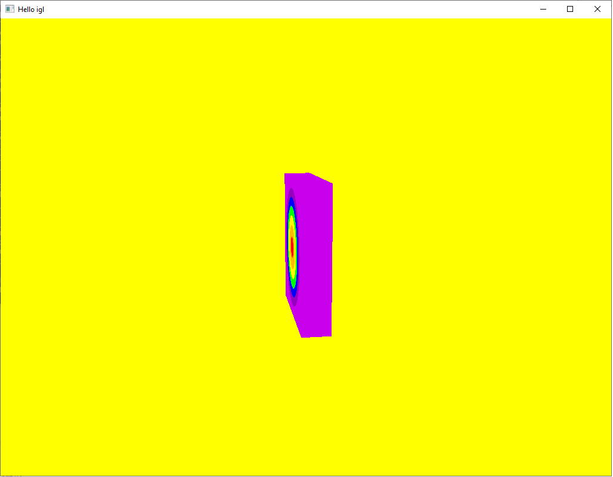

# Examples

1) [Tiny](./samples/desktop/Tiny/Tiny.cpp)

A basic example showing how to render a triangle.

2) [Tiny_Mesh](./samples/desktop/Tiny/Tiny_Mesh.cpp)

An intermediate example showing how to render multiple textured meshes and ImGui integration.

3) [Tiny_MeshLarge](./samples/desktop/Tiny/Tiny_MeshLarge.cpp)

A complex example demonstrating most of IGL features and rendering the Lumberyard Bistro mesh. Learn how to draw the rest of the owl.

# RenderSessions

RenderSessions use iglshell functionality that provides platfrom abstraction and basic application functionality.
We provide some basic examples that you can use in your projects

1)  [EmptySession](./shell/renderSessions/EmptySession.cpp)

An empty session. You can use it as a template for a new project

2)  [BasicFramebufferSession](./shell/renderSessions/BasicFramebufferSession.cpp)

A basic session showing how to create a framebuffer

3)  [HelloWorldSession](./shell/renderSessions/HelloWorldSession.cpp)

A basic session showing how to render a triangle

4)  [ColorSession](./shell/renderSessions/ColorSession.cpp)

A basic session showing how to render a textured quad

5)  [ImguiSession](./shell/renderSessions/ImguiSession.cpp)

A basic session showing how to use ImGUI with IGL

6)  [MRTSession](./shell/renderSessions/MRTSession.cpp)

A basic session showing how to use multiple render targtes feature

7)  [Textured3DCubeSession](./shell/renderSessions/Textured3DCubeSession.cpp)

A basic session showing how to use 3D textures

8)  [TQMultiRenderPassSession](./shell/renderSessions/TQMultiRenderPassSession.cpp)

A basic session showing how to use multiple render passes

And many more sessions are coming!
